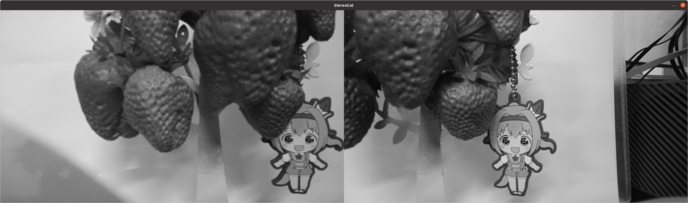

# depthai-core-Template
[depthai-core](https://github.com/luxonis/depthai-core) configure Template

## Install and build dependencies

```bash
bash setup_depthai_core.bash
# > password
```

## Build (your) project

```bash
mkdir build
cd build
cmake ..
make -j$(nproc)
```

### run stereo_hconcat

```bash
./stereo_hconcat
```

<br>

